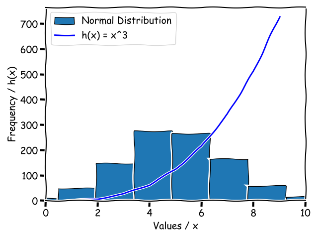

# pands-weekly-tasks

This repository contains solutions to the weekly problem sheets in the module Programming and Scripting, 2024 @ ATU.


## Contents

| week | program       |
|-----:|---------------|
|     1| helloworld.py |
|     2| bank.py       |
|     3| accounts.py   |
|     4| collatz.py    |
|     5| weekend.py    |
|     6| squareroot.py |
|     7| es.py         |
|     8| plottask.py   |


# Get Started

Python is a general purpose programming language. The Python interperter can be downloaded [here](https://www.python.org/downloads/). 

Several [packages](https://pypi.org/) were used in the analysis.

Install the required packages using the following command:

```
python pip install pandas matplotlib seaborn numpy
```

More information about the packages used in this analysis can be found below:

1. Pandas
   - https://pandas.pydata.org/

2. Matplotlib
   - https://matplotlib.org/

3. Seaborn
   - https://seaborn.pydata.org/

4. NumPy
   - https://numpy.org/


Clone the repository:

```
git clone https://github.com/holmstead/pands-project.git
```

Once everything is installed and the repository cloned, you can run a program by opening the command line and typing the commands shown in the program descriptions below.


# About

## 1. `helloworld.py`

This program prints "hello World!" to the console.

Example:

```
$ python hello world.py
Hello World! 
```

## 2. `bank.py`

This program takes two integers (cents) from the user, adds them together and returns the value in Euros. *Automate the Boring Stuff* has a good chapter on basic input/output and simple math operations

- https://automatetheboringstuff.com/2e/chapter1/

Uses a function to read integer from user, and a function to add cents then convert to euro.

- https://www.w3schools.com/python/python_functions.asp

It uses Exception handling to check if a valid integer was entered or not.

See link below for Exception handling examples using while loops, and handling ValueErrors
   
- https://www.freecodecamp.org/news/exception-handling-python/

ValueError is a built-in exception in python:
   
- https://docs.python.org/3/library/exceptions.html
   
According to the Python docs ValueErrors are ... 
   
> Raised when an operation or function receives an argument that has the right type but an inappropriate value, and the situation is not described by a more precise exception such as IndexError.

Example:

```
$ python bank.py 
Enter amount (in cent): 54
Enter amount (in cent): 345
The sum of these is €3.99
```

## 3. `accounts.py`

This program reads in a 10 character account number and outputs the account number with only the last 4 digits showing (and the first 6 digits replaced with Xs).

Numbers are stored as strings. As w3schools states, "strings are arrays". Array operation apply to strings.

- https://www.w3schools.com/python/python_strings.asp

Spaces were stripped from the string using string.replace()

- https://www.w3schools.com/python/ref_string_replace.asp

Length of the account number determined using len()

- https://realpython.com/len-python-function/

The last 4 characters can be printed using splicing:

- https://www.freecodecamp.org/news/python-slicing-how-to-slice-an-array/
    
```
array[start:stop:step]
```

Array can be navigated using indices Arrays start at zero in python. The below code prints the first character of the array:
   
```
print(account_number[0])
```

How to print last character of an array? negative indexing:

- https://www.askpython.com/python/list/negative-indexing

Removed space between Xs and the 4 numbers using sep=""

- https://realpython.com/lessons/sep-end-and-flush/
   
```
print('X' * number_of_Xs, account_number[-4:], sep="")
```

Example:

```
$ python accounts.py 
Please enter an 10 digit account number: 1234567890
XXXXXX7890
```

## 4. `collatz.py`

This program reads in a positive integer and performs the collatz conjecture.

A loop is used, the While loop:

- https://realpython.com/python-while-loop/

The Conditional statement if/else is used:

- https://realpython.com/python-conditional-statements/

The modulo operator can be used to determine if a given integer is even or odd:

- https://www.freecodecamp.org/news/the-python-modulo-operator-what-does-the-symbol-mean-in-python-solved/

Example:

```
$ python  collatz.py 
Please enter a positive integer: 34
17 52 26 13 40 20 10 5 16 8 4 2 1
```

## 5. `weekdays.py`

This program determines the day of the week and responds appropriately.

Uses the datetime library:

- https://docs.python.org/3/library/datetime.html

Print name of day using the strftime() function:

- https://docs.python.org/3/library/datetime.html#strftime-strptime-behavior

- https://www.geeksforgeeks.org/python-strftime-function/

Create main() function:

- https://realpython.com/if-name-main-python/

- https://www.youtube.com/watch?v=g_wlZ9IhbTs&t=103s

Example on a Monday:

```
$ python weekday.py 
Today is Monday
Yes, unfortunately today is a weekday.
```

## 6. `squareroot.py`

This program reads in a positive float and give the approximate square root using the Newton–Raphson method.

See Equation 4.9.1 in link below:

- https://math.libretexts.org/Bookshelves/Calculus/Calculus_(OpenStax)/04%3A_Applications_of_Derivatives/4.09%3A_Newtons_Method
    
See the square root example on Wikipedia:

- https://en.wikipedia.org/wiki/Newton's_method#Square_root

We can write x = sqrt(a)

Therefore: x^2 = a 

Or we can write it as: x^2 - a = 0

The derivative of that is 2x

Plug the guess into the equation

Then use the result to put back into the equation
   see 4.9.1 example in libretexts link above

Compare the new result with the previous result

Each time the difference will get smaller and smaller as 
it converges toward the correct answer

Closer to zero is closer to correct answer

Example:

```
$ python squareroot.py 
Enter an integer to determine the square root: 64
The square root is approximately: 8.00000000000017
Built in method says: 8.0
```

## 7. `es.py`

This program reads in a textfile (given as an arguement) and counts the number of instances of the letter E.

The sys library is used to take arguements in the command line, sys.argv specifically.

- https://docs.python.org/3/library/sys.html

Opened the file (example.txt) in read-only mode, using the "with open" way as it automatically closes the file after:

- https://www.freecodecamp.org/news/with-open-in-python-with-statement-syntax-example/

Some built-in string methods are used, such as str.lower()

- https://docs.python.org/3/library/stdtypes.html#string-methods

Check if two arguements were passed in to python i.e. the script name 'es.py' and the textfile name 'example.txt'

- https://stackoverflow.com/questions/2626026/python-sys-argv-lists-and-indexes

Handles FileNotFound errors

- https://docs.python.org/3/library/exceptions.html

Uses sys.exit() to kill program if not enough arguements passed in 

- https://docs.python.org/2/library/sys.html#sys.exit

Example:

```
$ python es.py boolean_limerick.txt 
14
```

## 8. `plottask.py`

This program displays a histogram of a normal distribution of a 1000 values with a mean of 5 and standard deviation of 2, and a plot of the function  h(x)=x3 in the range 0 to 10 on the one set of axes.

The 'Generator' combined with default_rng() function for random number generation:

- https://numpy.org/doc/stable/reference/random/generator.html#numpy.random.Generator

Use default_rng() method 'random number generator' to generate a random float which we will then use to produce useful distributions

- https://numpy.org/doc/stable/reference/random/generator.html#numpy.random.default_rng

From the docs: "default_rng is the recommended constructor for the random number class Generator"

- https://numpy.org/doc/stable/reference/random/generator.html

Returns an "initialized generator object".

You can give a seed number for pseudorandom numbers.


Normal distribution:

- https://numpy.org/doc/stable/reference/random/generated/numpy.random.Generator.normal.html#numpy.random.Generator.normal

Matplotlib is used for plotting:

- https://realpython.com/python-matplotlib-guide/

Tried to use the stateless approach:

- https://realpython.com/python-matplotlib-guide/

Histogram of the array:

- https://matplotlib.org/stable/api/_as_gen/matplotlib.pyplot.hist.html

- https://matplotlib.org/stable/gallery/statistics/hist.html

Line plotted using plot() function:

- https://matplotlib.org/stable/api/_as_gen/matplotlib.pyplot.plot.html

The figure is styled using xkcd:

- https://matplotlib.org/stable/api/_as_gen/matplotlib.pyplot.xkcd.html

The tight_layout() funtion is used to auto adjust plots to fit everything in nicely:

- https://matplotlib.org/stable/api/_as_gen/matplotlib.pyplot.tight_layout.html

Example:

```
$ python plottask.py
```

Generates the following output:



## Note

README file is styled following several guides. The "Basic writing and formatting syntax" guide shows how to format headings, make lists, add links, add images, formatting code blocks etc.

- https://docs.github.com/en/get-started/writing-on-github/getting-started-with-writing-and-formatting-on-github/basic-writing-and-formatting-syntax

FreeCodeCamp and GitHub both give a good overview of how to create a _good_ README, and why thats important:

- https://www.freecodecamp.org/news/how-to-write-a-good-readme-file/

- https://github.com/coderefinery/documentation/blob/main/content/writing-readme-files.md


Git commit messages are styled following git guides: 

- https://github.com/git-guides/git-commit


## Get Help

Python libraries Matplotlib, Pandas, Seaborn, and NumPy all have comprehensive user guides and tutorials in the official docs:

- https://matplotlib.org/stable/users/index.html

- https://pandas.pydata.org/pandas-docs/stable/user_guide/index.html

- https://seaborn.pydata.org/tutorial.html

- https://numpy.org/doc/stable/user/index.html


Juypter Notebooks and VSCode user guides can be found here:

- https://jupyter.brynmawr.edu/services/public/dblank/Jupyter%20Notebook%20Users%20Manual.ipynb

- https://code.visualstudio.com/docs/introvideos/basics


RealPython website has a good Pandas tutorial:

- https://realpython.com/pandas-dataframe/

## Author

M. Holmes, 2024

email: holmstead@protonmail.com